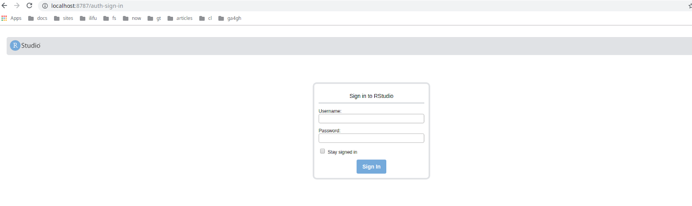

# 16S Intermediate Bioinformatics Training -  Software setup and testing

1. [Test sshing into the cluster](#1.-test-sshing-into-the-cluster)
2. [Running RStudio on a cluster](#2.-running-rstudio-on-a-cluster)
3. [Running the DADA2 Nextflow pipeline on test data](#3.-running-the-dada2-textflow-pipeline-on-test-data)

## 1. Test sshing into the cluster
Use your [`USERNAME`](https://docs.google.com/spreadsheets/d/1eky5z6oltTRo_SDELbyxd5Vi-f8Ub-oRYp_slAqUOQU/) (if you have not send your public key ssh would not work)
```
$ ssh USERNAME@cbio-training.ilifu.ac.za
USERNAME@cbio-login:~$ hostname
slurm_login
```

Submit an interactive job
```
$ srun --nodes=1 --ntasks 1 --mem=8g --pty bash
gerrit@cbio-compute-01:~$ hostname
cbio-compute-01
```

## 2. Running RStudio on the Ilifu SLURM cluster

The steps works for both Linux and Windows users. Windows users please use git-bash.

Firstly one should configure ssh in such a way that it is simple to connect to a worker node once a job is running. The easiest way it to add the following to your local ~/.ssh/config file on your local machine. To open your config file:
nano `~/.ssh/config` 

Need to do this on your local machine
```
Host cbio-training.ilifu.ac.za
    User USERNAME
    ForwardAgent yes

Host cbio-compute-*
    Hostname %h
    User USERNAME
    StrictHostKeyChecking no
    ProxyCommand ssh cbio-training.ilifu.ac.za nc %h 22
```
One should substitute your login ID (name) in `USERNAME` settings in the above script.

Open up a terminal. And start  a new session.
```
$ ssh gerrit@cbio-training.ilifu.ac.za
```

Next is the process of starting an interactive job and launching RStudio. To begin start an interactive job – below is an example of launching a single node / 1 core job with 8Gb of ram:
```
USERNAME@cbio-login:~$ srun --nodes=1 --ntasks 1 --mem=8g --pty bash
USERNAME@cbio-compute-01:~$
```
Once the interactive session has begun on a specific node (in this case slurm_worker-0002), RStudio can be launched as follows:

```
USERNAME@cbio-compute-01:~$ RSTUDIO_PASSWORD='Make your own secure password here' /ceph/containers/bionic-R3.6.1-RStudio1.2.1335-bio.simg
```

Running rserver on port 45299

This will launch an RStudio server listening on a random free port (in this case 45299). Now one needs to do port-forward from your local machine to the host machine. 

Open up a new terminal. One connects to the appropriate node by running:
```
ssh cbio-compute-01 -L8082:localhost:45299
```
On your local machine. Specifically what this does is forward traffic on your local machine's port 8082 to the worker node's port 37543 (and it knows how to connect to slwrk-103 by using the .ssh/config settings above). One may use any free local port – ssh will complain if you choose something that is not free with an error message approximating:
```
bind [127.0.0.1]:8000: Address already in use
channel_setup_fwd_listener_tcpip: cannot listen to port: 8000
```
Finally in your browser you can connect to http://localhost:8082 and you can login with your `USERNAME` and the `RSTUDIO_PASSWORD` which you set.



DADA2 should be installed already
```
> library("dada2")
Loading required package: Rcpp
Registered S3 methods overwritten by 'ggplot2':
method from
[.quosures rlang
c.quosures rlang
print.quosures rlang
> packageVersion("dada2")
[1] ‘1.12.1’
```
Looks OK.

## 3. Running the DADA2 Nextflow pipeline on test data

Do the setup
```
$ cd $HOME
$ git clone https://github.com/h3abionet/16S-rDNA-dada2-pipeline
$ cd $HOME/16S-rDNA-dada2-pipeline
```

Run nextflow
```
$ nextflow run main.nf -profile training --reads="/ceph/data/test-data/*_R{1,2}.fastq.gz" --trimFor 24 --trimRev 25 --reference="/ceph/data/ref-data/silva_nr_v132_train_set.fa.gz" --species="/ceph/data/ref-data/silva_species_assignment_v132.fa.gz" --outdir="$HOME/out"
N E X T F L O W  ~  version 19.07.0
Launching `main.nf` [exotic_heisenberg] - revision: 1696132777
===================================
uct-cbio/16S-rDNA-dada2-pipeline  ~  version 0.4
===================================
Run Name       : exotic_heisenberg
Reads          : /cbio/data/test-data/*_R{1,2}.fastq.gz
trimFor        : 24
trimRev        : 25
truncFor       : 248
truncRev       : 212
truncQ         : 2
maxEEFor       : 2
maxEERev       : 2
maxN           : 0
maxLen         : Inf
minLen         : 50
rmPhiX         : T
minOverlap     : 20
maxMismatch    : 0
trimOverhang   : F
species        : /cbio/data/ref-data/silva_species_assignment_v132.fa.gz
pool           : pseudo
Reference      : /cbio/data/ref-data/silva_nr_v132_train_set.fa.gz
Max Memory     : 384 GB
Max CPUs       : 40
Max Time       : 3d
Output dir     : /cbio/home/gerrit/out
Working dir    : /cbio/home/gerrit/16S-rDNA-dada2-pipeline/work
Container      : /cbio/containers/16s-rdna-dada2-pipeline.simg
Current home   : /cbio/home/gerrit
Current user   : gerrit
Current path   : /cbio/home/gerrit/16S-rDNA-dada2-pipeline
Script dir     : /cbio/home/gerrit/16S-rDNA-dada2-pipeline
Config Profile : training
=========================================
executor >  local (15)
[fd/c5dfb3] process > runFastQC (rFQC.Dog24)                          [100%] 4 of 4 ✔
[9e/6a2141] process > runMultiQC (rMQC)                               [100%] 1 of 1 ✔
[95/9e5acf] process > filterAndTrim (filterAndTrim)                   [100%] 4 of 4 ✔
[37/15cf0a] process > runFastQC_postfilterandtrim (rFQC_post_FT.Dog2) [100%] 4 of 4 ✔
[-        ] process > runMultiQC_postfilterandtrim                    
[-        ] process > mergeTrimmedTable                               
[dc/19e08d] process > LearnErrorsFor (LearnErrorsFor)                 [100%] 1 of 1 ✔
[7e/62c5a5] process > LearnErrorsRev (LearnErrorsRev)                 [  0%] 0 of 1
[-        ] process > SampleInferDerepAndMerge                        
[-        ] process > mergeDadaRDS                                    
[-        ] process > SequenceTable                                   
[-        ] process > ChimeraTaxonomySpecies                          
[-        ] process > AlignAndGenerateTree                            
[-        ] process > BiomFile                                        
[-        ] process > ReadTracking                                    
```
Looks OK.
